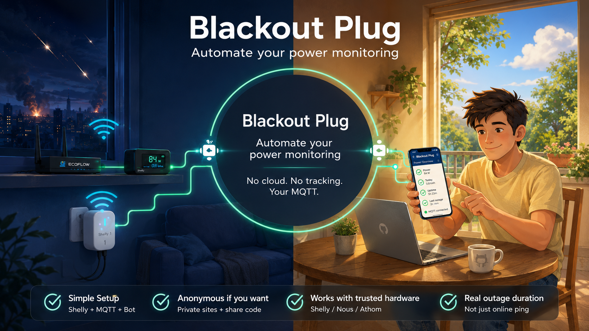
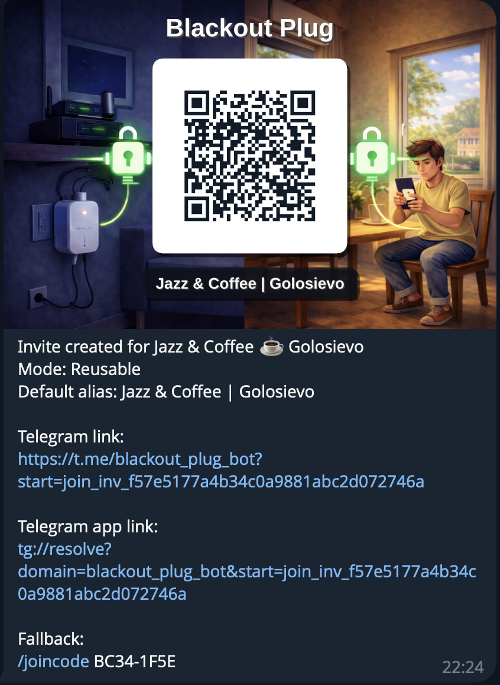

#  BlackoutPlug

**BlackoutPlug** is a VPS-hosted power outage monitoring and Telegram notification system for homes, cafés, small shops, and neighbor groups.

It uses a **Shelly Plug** as a simple power-status signal source. The plug is installed at the monitored place, publishes MQTT status to a **Mosquitto broker on a VPS**, and BlackoutPlug turns those signals into outage history and Telegram notifications.

> Current product focus: **reliable power-status monitoring and notifications**.
> Remote plug management is **not available in the current release**, but it is a planned direction for a future release.


## Why it exists

Power outages create practical questions:

- Is power out at home while I am away?
- Did electricity come back before the router, fridge, cameras, or shop equipment became a problem?
- Can relatives, neighbors, or staff subscribe to the same location instead of asking in chat every 12 minutes?
- Can this work without depending on Shelly Cloud or another vendor cloud as the core monitoring path?

BlackoutPlug answers those questions with a small, understandable chain:

```text
Shelly Plug at the site -> MQTT over Internet -> VPS broker -> backend state engine -> Telegram
```

## What it does

| Capability | User value |
|---|---|
| Power ON/OFF detection | Know when electricity is lost or restored. |
| Telegram notifications | Receive alerts in the app people already use. |
| Site model | Track a home, shop, office, café, or shared building location. |
| Share-code joining | Let family/neighbors subscribe without publishing the address. |
| QR invite sharing | Share a site in person with a QR card, Telegram link, or app deep link. |
| Multi-device concept | Add more than one source for a site when reliability matters. |
| Outage history | Check recent events instead of relying on memory. |
| Privacy-first setup | Private sites by default; anonymous labels are possible. |
| VPS-hosted operation | Monitoring continues even when you are not on the local network. |
| Future direction | Remote plug/device management can be added in a future release. |

## Product visuals

<p align="center">
  
</p>

## Who it is for

### Home users

A Shelly Plug is connected to power and Wi-Fi. BlackoutPlug watches the plug’s MQTT status and notifies you when the monitored place loses or regains electricity.

### Families and neighbors

One person can set up monitoring for a shared site. Others can join with a share code or a QR invite card and receive the same outage/restore notifications.

This is one of the major product features for neighborhood sharing. People do not need to know everyone in advance or manage a noisy local chat. A café, building lobby, or volunteer can show a QR card, and nearby people can join the same site from Telegram in a few taps.

### Cafés, small shops, and offices

Staff can monitor power status without installing a heavy dashboard or exposing more access than needed for the current release.

### Technical collaborators

This repository shows the product thinking, user flow, and architecture behind the project without publishing private implementation details, exact API contracts, infrastructure secrets, or enough internals to recreate the private system directly from the public docs.

## How it works

<p align="center">
  
</p>

The Shelly device publishes status to a Mosquitto MQTT broker hosted on a VPS. The backend service normalizes Shelly signals, applies outage-state logic, stores history, and publishes site-level events. The Telegram bot delivers notifications and provides the mobile-first user flow.

## Main use cases

- **Away from home:** get notified when home power goes down and when it comes back.
- **Parents or relatives:** one family member sets up the plug, others subscribe.
- **Neighbor group:** one monitored location becomes a shared signal for people nearby.
- **Small business:** owner and staff know when equipment, routers, or refrigerators may be affected.
- **Product walkthrough:** show an understandable “sensor -> event -> notification” flow without exposing private implementation details.

More detail: [Use cases](docs/use-cases.md)

## Device focus

The public overview focuses on **Shelly Plug / Shelly Plug S Gen3 class devices** because they provide a practical mobile setup flow, MQTT support, device status, voltage/current telemetry, and safety settings.

Other MQTT-capable devices can be explored later, but this public repository intentionally uses Shelly resources for the main product explanation.

See: [Device setup preview](docs/device-setup-preview.md)

## Security and privacy principles

- BlackoutPlug is **VPS-hosted**, not a home-LAN-only local service.
- In the current release, the plug is used primarily as a **status source**.
- Remote plug/device management is **not yet available** in the current release.
- The core monitoring path uses MQTT to the VPS, not Shelly Cloud.
- Device credentials should be per-device.
- Devices should publish only to their own allowed topic area.
- Sites are private by default.
- Share codes are preferred over public address discovery.
- Public repository docs intentionally avoid API details, DB schema dumps, production domains, secrets, and deployment playbooks.

See: [Security and privacy](docs/security-privacy.md)

## Engineering highlights

This project is compact enough to understand but rich enough to show real engineering decisions:

- Rust backend service and Rust Telegram bot
- MQTT ingestion from Shelly devices
- VPS-hosted Mosquitto and PostgreSQL
- Normalized outage event publishing
- Multi-device/site model
- State transition logic with hysteresis and confidence concepts
- CQRS-style command/query separation
- Vertical-slice feature organization
- Docker/VPS deployment thinking
- Public/private site discovery model

See: [Engineering overview](docs/engineering-overview.md)

## BlackoutPlug bot

The Telegram bot is the main user-facing control point for setup, notifications, and status checks.

<p align="center">
  
</p>

- Bot public link: https://t.me/blackout_plug_bot
- Official channel: https://t.me/BlackoutPlug

### Wizard hierarchy (main menu + UX layout spec)

Current root reply-keyboard layout (EN labels; UK uses the same row/column geometry with localized labels):

```text
Wizard Root
  Row1: 📍 Sites       |      ⚡ Status
  Row2: ➕ Add | 🔎 Find & Join | ✅ My
  Row3:   ⚙️ Settings  | 🕒 History 24h
  Row4: ✖️ Cancel      |  📘 How To Use

Settings
  Row1:          ℹ️ Info
  Row2: 🌐 Language | 🕓 Timezone
  Row3:         ✉️ Feedback
  Row4: ⬅️ Back     |   ✖️ Cancel
```

### QR invite sharing

BlackoutPlug can create reusable invite cards for a site. Each card can include:

- a QR code for fast in-person joining;
- a Telegram web link for copying into chats;
- a Telegram app deep link for mobile open-in-app flow;
- a fallback join code for cases where QR scanning fails.

This matters for neighborhood use. A place such as `Jazz & Coffee | Golosievo` can share one monitored site with nearby people even when they do not know each other personally.

Example invite components:

<p align="left">
  
</p>


- Telegram link: `https://t.me/blackout_plug_bot?start=join_inv_f57e5177a4b34c0a9881abc2d072746a`
- Telegram app link: `tg://resolve?domain=blackout_plug_bot&start=join_inv_f57e5177a4b34c0a9881abc2d072746a`
- Fallback: `/joincode BC34-1F5E`

## Shelly screenshots

These screenshots are redacted public references. They show the kind of Shelly resources used during setup and verification, not production credentials.

### Shelly MQTT setup

<p>
  
  
</p>

### Shelly status and telemetry

<p>
  
  
</p>

### Shelly safety / network setup references

<p>
  
  
</p>

## Repository purpose

This repository is a **public overview / landing-page repository** for BlackoutPlug.

It is meant for:

- explaining the product to pilot users;
- explaining the architecture and user flow to collaborators;
- collecting feedback before broader public release;
- presenting a safe public overview without exposing private internals.
- collecting bug reports.

It is **not** the full private source repository and does not include sensitive implementation details.

## Feature requests and next release ideas

Want to influence the next release?

- Open a **GitHub Issue** in this repository.
- Describe the feature or improvement you want to see.
- If useful, include your use case: home, family, neighborhood, or business monitoring.

Examples of future directions:

- remote plug/device management;
- richer outage history and diagnostics;
- additional device support beyond Shelly-focused public examples;
- improved onboarding and setup UX.

## Documentation

- [Product overview](docs/product-overview.md)
- [VPS hosting model](docs/vps-hosting-model.md)
- [Public architecture](docs/architecture-public.md)
- [Use cases](docs/use-cases.md)
- [Device setup preview](docs/device-setup-preview.md)
- [Security and privacy](docs/security-privacy.md)
- [User Manual pdf](docs/how_to_use_en.pdf)
- [FAQ](docs/faq.md)

## Project status

BlackoutPlug is an MVP v0.2 / pilot-oriented product with working technical slices and ongoing UX, reliability, and deployment hardening.

The public docs describe the **principle, value, and architecture**, not production credentials, private repositories, or full API contracts.

## License

The BlackoutPlug project and its implementation remain private.

This repository contains public documentation only. The documentation in `README.md` and `docs/` may be used, shared, and adapted with attribution.
