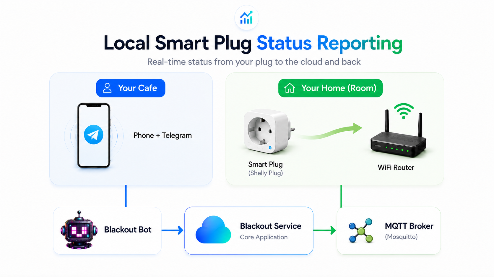
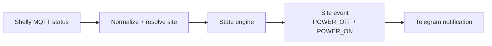
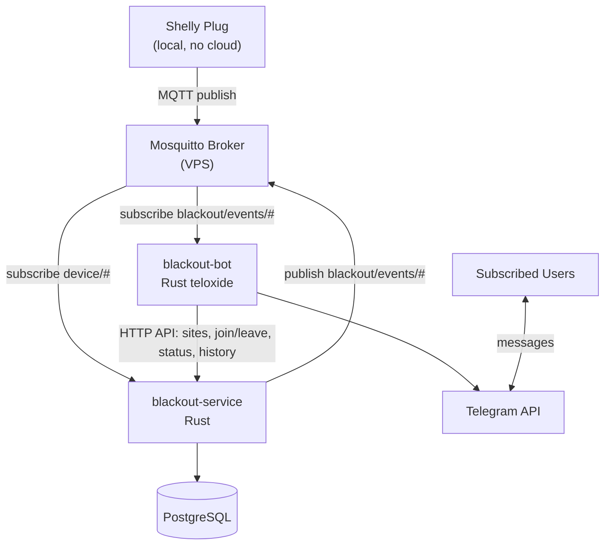

# Public Architecture

This page describes the BlackoutPlug architecture at a public, non-cloneable level. It intentionally avoids private API contracts, database schema details, production domain names, credentials, and deployment runbooks.

## Stack summary

| Area | Technology |
|---|---|
| Device signal | Shelly Plug MQTT |
| Broker | Mosquitto on VPS |
| Backend service | Rust |
| Bot | Rust + Telegram Bot API |
| Storage | PostgreSQL |
| Runtime | Docker/VPS-oriented deployment |
| Architecture style | Vertical slices + CQRS-style separation |

## High-level flow

  

## Components

### Shelly Plug

The plug is the physical signal source. It is installed at the monitored location and publishes MQTT messages that indicate whether the device is reachable and what power telemetry it sees.

The current public product principle is simple:

> In the current release, the plug reports status to BlackoutPlug. Remote plug management is not yet available, but it can be introduced in a future release.

Shelly app screens may show control buttons and safety settings. Those are Shelly resources, not the current BlackoutPlug monitoring contract.

### Mosquitto broker on VPS

Mosquitto receives device messages over the Internet and carries normalized internal events.

Public-facing security expectations:

- authentication enabled;
- TLS preferred for Internet-facing MQTT;
- per-device publish boundaries;
- no unauthenticated public MQTT;
- control/RPC topics avoided for device clients in the current release.

### blackout-service

The backend service is responsible for:

- reading Shelly MQTT messages;
- mapping device signals to sites;
- applying power-state logic;
- persisting current status and event history;
- publishing normalized site-level events.

The implementation uses feature-oriented slices and separates write operations from read operations. This keeps the public mental model clean.

### PostgreSQL

PostgreSQL stores durable state:

- sites;
- memberships;
- devices/sources;
- current status;
- power event history.

The public repository does not publish full schema details.

### blackout-bot

The Telegram bot provides the mobile-first UX:

- onboarding;
- site creation/joining;
- status checks;
- history checks;
- quiet hours;
- notifications;
- share-code flows.

## Main engineering areas

### MQTT ingestion

The backend consumes device messages from the VPS broker and keeps device parsing isolated from the bot.

### State transitions

Raw device signals are converted into site-level states such as power on and power off. The private implementation can include hysteresis, confidence, and multi-source behavior.

### Persistence

Outage status and history are stored so users can check what happened later, not just receive a one-time notification.

### Telegram UX

The bot gives users a mobile-first flow for setup, status checks, history, share codes, and notifications.

### VPS operations

The system is designed to run as a small production-style stack on a VPS:

- broker;
- service;
- bot;
- database;
- private deployment automation.

## Why normalize events

Shelly MQTT messages are implementation details. BlackoutPlug keeps device parsing inside the service and emits a clean site-level event for the bot.

## Reliability model

A single Shelly Plug is useful. Multiple sources are better when a site needs stronger confidence.

BlackoutPlug can model multiple device sources for one site and surface confidence when sources disagree. The exact conflict policy belongs in the private implementation, not in a public landing repo.

## Architecture Diagrams

### Flow Diagram (recommended)

## Architecture principles

### Vertical Slice Architecture

Features are organized as coherent slices rather than large horizontal layers. For this project, a feature can include request and handler logic, domain orchestration, persistence, MQTT interactions, and tests.

### CQRS-style separation

Commands change state and enforce permissions. Queries read status and history for bot UX.

### Lightweight domain modeling

The codebase models practical concepts such as Site, Device Source, Membership, Power State, and Notification, without unnecessary abstraction.

## Public vs private architecture details

| Public docs include | Private docs/code keep |
|---|---|
| System purpose | Full API contracts |
| VPS-hosted component diagram | Database schema details |
| Security principles | Production domains and credentials |
| Use cases | Broker ACL implementation details |
| Shelly setup preview | Deployment playbooks and secret strategy |
| Engineering principles | Internal migration history and runbooks |
