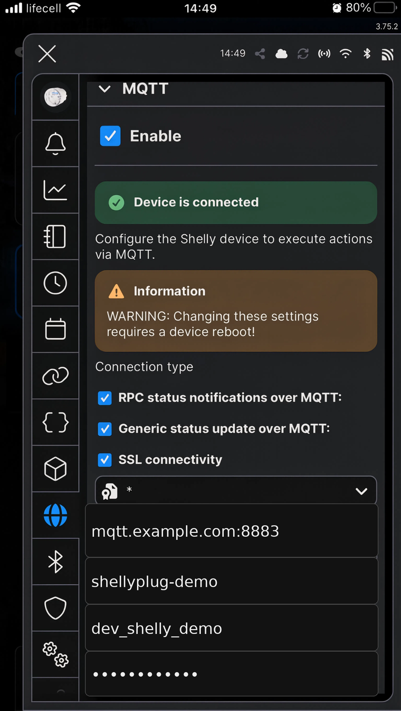
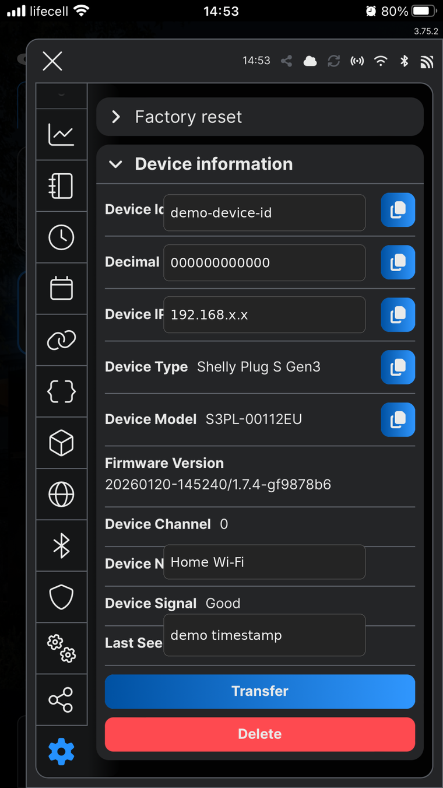
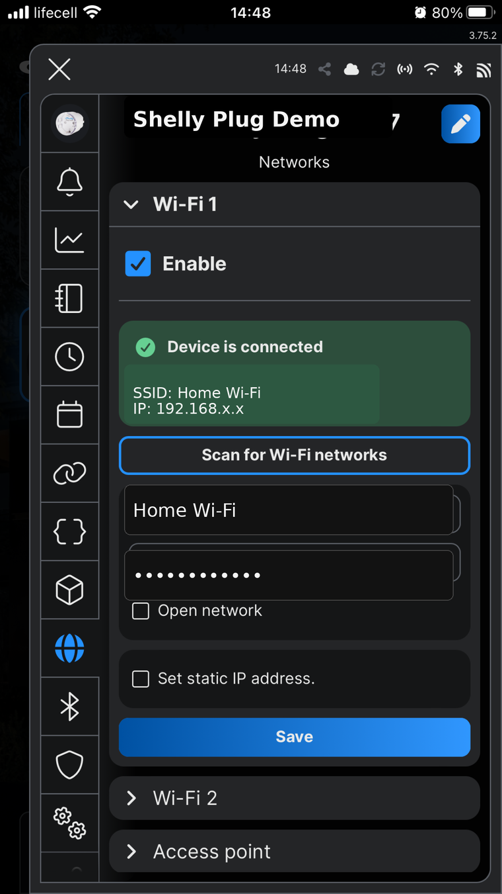
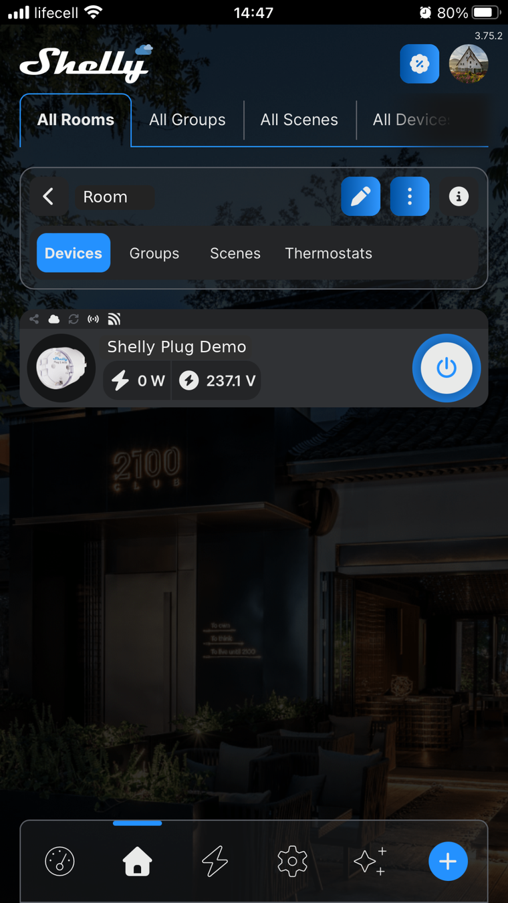
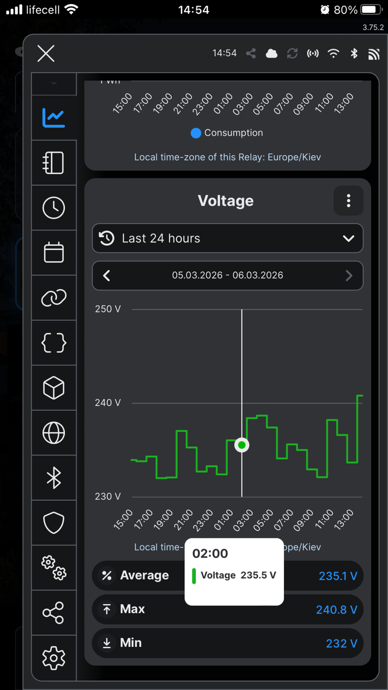
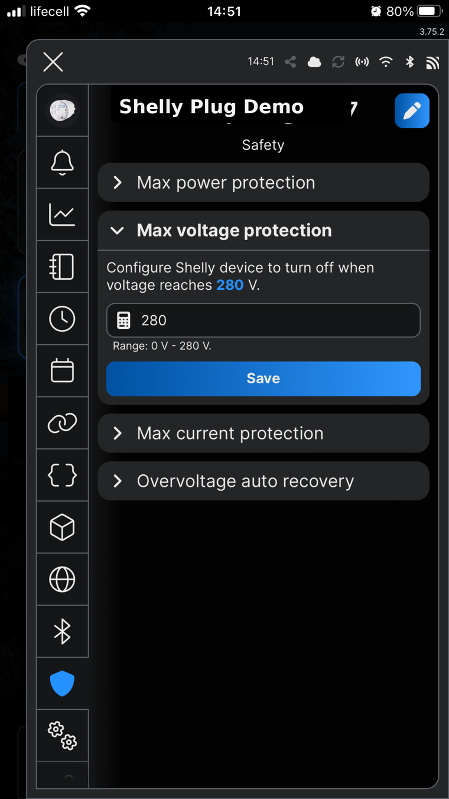

# Device Setup Preview

This page provides a public, high-level preview of Shelly device setup. It is not a full operational runbook.

## Setup principle

A Shelly Plug must be configured to publish MQTT messages to a custom broker hosted on the BlackoutPlug VPS.

BlackoutPlug does not provide the device setup interface. Setup is done in the Shelly Inventory mobile app or the Shelly web app/device web UI.

After the device is configured, BlackoutPlug maps it to a site and uses its status messages as a power signal.

## Device focus

| Device category | Public-doc status |
|---|---|
| Shelly Plug / Shelly Plug S Gen3 | Main supported setup story for public docs. |
| Other MQTT-capable plugs | Possible future/advanced integrations, not the public focus here. |

Always verify the exact model and firmware before purchasing hardware.

## Typical setup steps

1. Connect the Shelly Plug to the monitored site’s Wi-Fi network.
2. Open the Shelly Inventory mobile app or the Shelly web app/device web UI.
3. Find the MQTT section.
4. Enable MQTT.
5. Enter the broker, port, username, password, client ID, and topic values provided for the deployment.
6. Save and reboot/reconnect if required.
7. Verify that BlackoutPlug receives the device status and that the site appears active.

The plug remains at the monitored location. The broker, backend service, database, and bot run on the VPS.

BlackoutPlug is not a setup app for the Shelly device. Its role begins after the device is connected and publishing MQTT messages correctly.

## MQTT setup example

This screenshot is a redacted public reference. It shows where the values go, not real production values.

## Device information reference

Shelly device information is useful during setup because the device ID and model help identify the correct plug.

## Wi-Fi setup reference

The plug needs Wi-Fi access and outbound connectivity to the VPS MQTT broker.

## Status and telemetry examples

Shelly provides status and power telemetry that are useful for verification.

  
  

## Safety settings reference

Shelly has its own device safety settings, such as voltage and current protection. BlackoutPlug does not need to control these settings to monitor outages.

## What successful setup looks like

After setup:

- the Shelly Plug connects to the Wi-Fi network;
- the Shelly Plug connects to MQTT on the VPS;
- BlackoutPlug receives status messages;
- Telegram status shows the site as active;
- power/network changes produce power lost/restored events.

## What this page intentionally omits

- production broker hostnames;
- real credentials;
- exact ACL rules;
- full topic parsing internals;
- private API calls;
- deployment commands.
