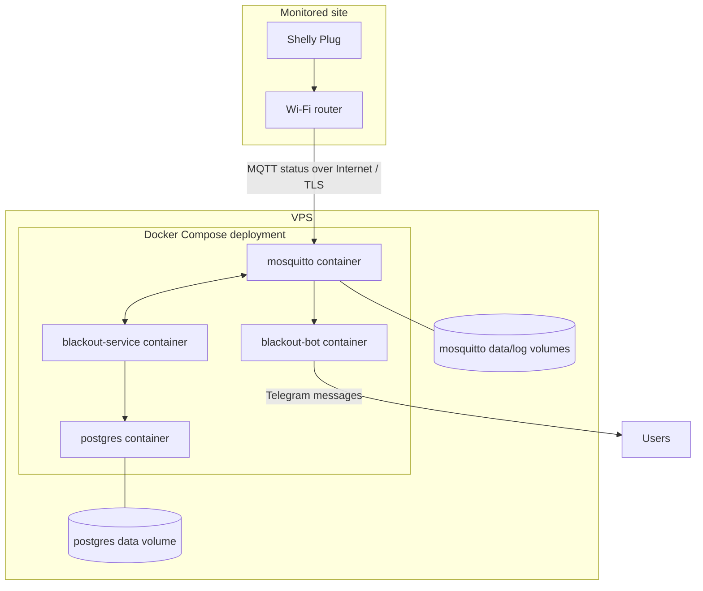

# VPS Hosting Model

BlackoutPlug is designed as a **VPS-hosted monitoring system**.

The Shelly Plug is physically installed at the monitored location, but the core monitoring stack runs outside that location on a VPS.

## Why not local-only?

A local-only setup has an obvious failure mode: when the monitored site loses power, local services may disappear too. Fascinatingly, power outage monitoring becomes less useful when it also goes unconscious.

A VPS-hosted model keeps the monitoring backend reachable for users and subscribers even when the monitored site is offline.

## Deployment shape

## What runs at the monitored site

- Shelly Plug
- Wi-Fi router
- Internet connection

The plug reports status. It does not need BlackoutPlug code running inside the home.

## What runs on the VPS

- Docker Engine + Compose-managed containers
- `mosquitto`
- `blackout-service`
- `postgres`
- `blackout-bot`
- Deployment/ops automation in the private repository

## Practical benefit

The VPS model supports:

- multiple users checking the same site;
- remote notifications;
- outage history that survives device reconnects;
- independent deployment and monitoring;
- future pilot/client onboarding without touching the home router beyond outbound MQTT.
